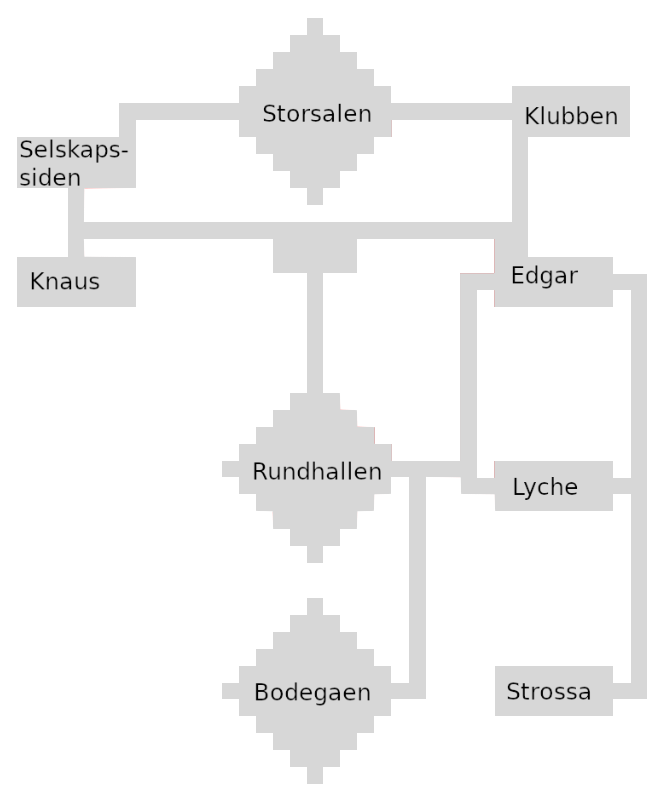
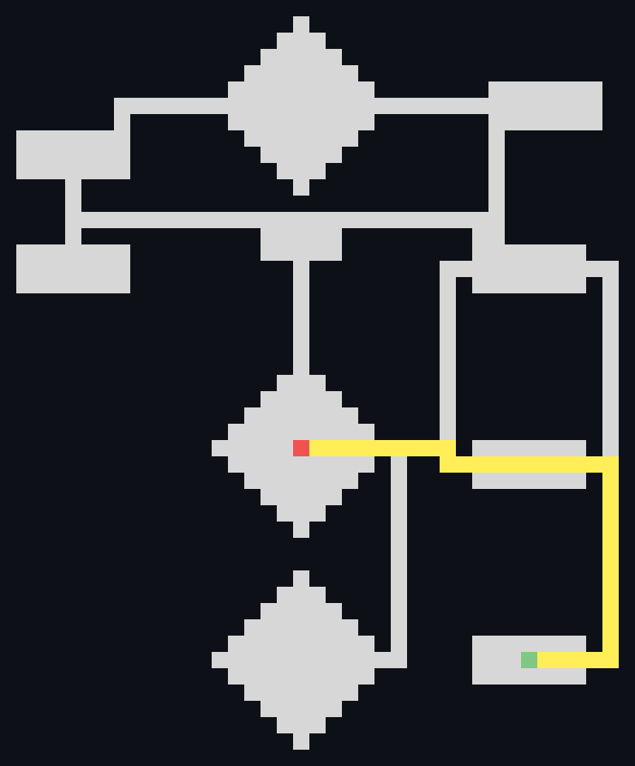
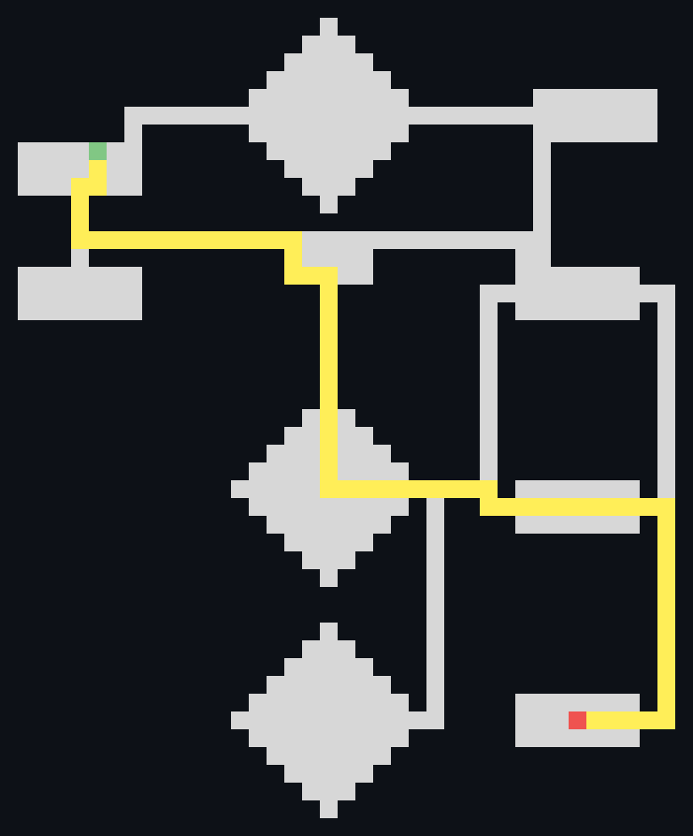
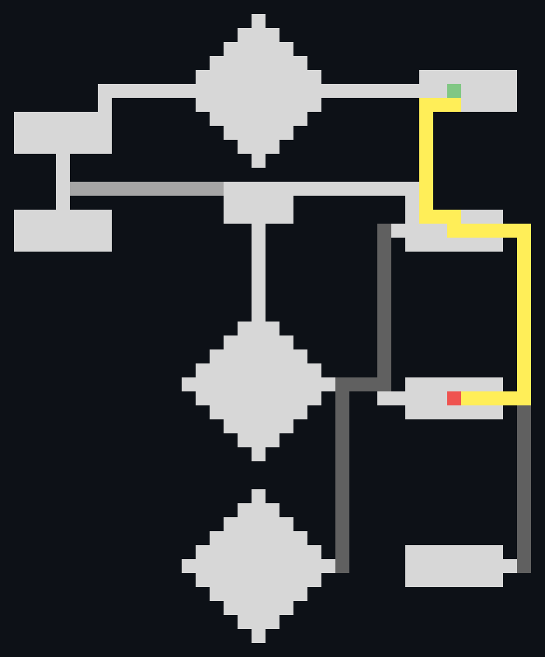
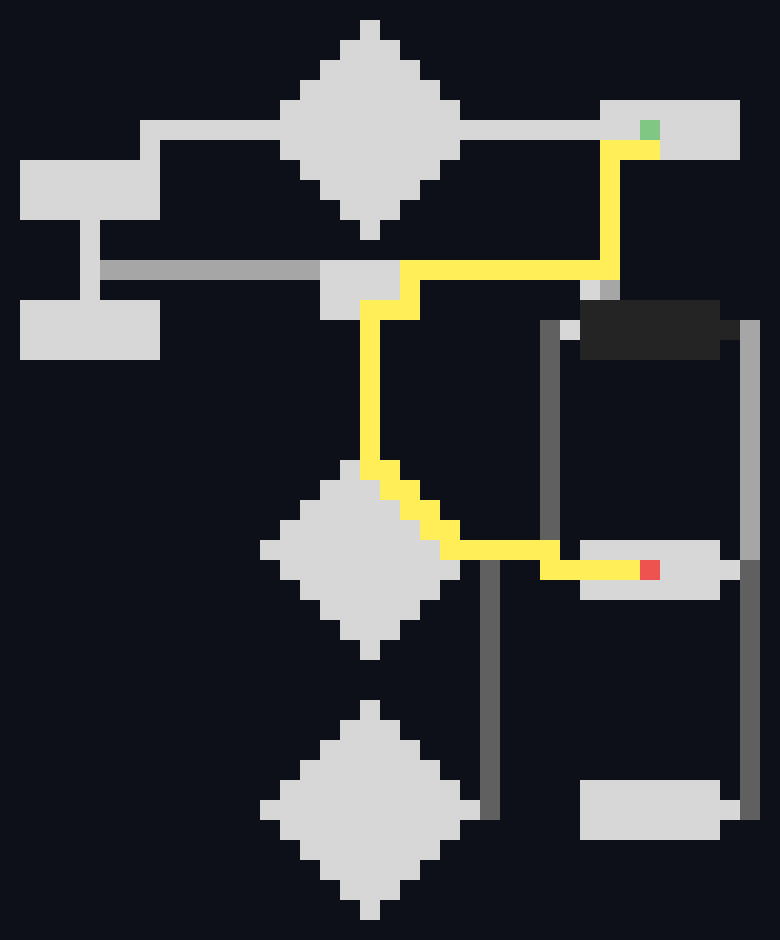

# Applying the A* Algorithm

<!-- 
```
ffmpeg -framerate 5 -loop 0 -i ./videos/task_1/%03d.png ./videos/task_1/visited.gif 
ffmpeg -framerate 5 -loop 0 -i ./videos/task_2/%03d.png ./videos/task_2/visited.gif 
ffmpeg -framerate 5 -loop 0 -i ./videos/task_3/%03d.png ./videos/task_3/visited.gif 
ffmpeg -framerate 5 -loop 0 -i ./videos/task_4/%03d.png ./videos/task_4/visited.gif 
ffmpeg -framerate 5 -loop 0 -i ./videos/task_5/%03d.png ./videos/task_5/visited.gif 

rm -rf ./videos/*/*.png
``` 
-->

### Samfundet map
<p align="center">
    
</p>

The solved tasks are visualized as follows. 

- Red Tile is start position
- Green Tile is goal position
- Yellow is the shortest path found by my algorithm
- Black Tiles are walls (cannot move here)
- Gray tiles (for task 4) mark cost of each tile (darker = higher cost)

To the right is a visualization of all the nodes the algorithm checked before finding the path. 

---

## Task 1

*You and your friend arrived at Samfundet only five minutes ago, but you’ve already managed to get separated. Being the resourceful person that you are, you call your friend, which tells you that they went looking for you and is currently located at Strossa. Your task is therefore to find the shortest path from Rundhallen (your location) to Strossa using your implementation of the A\* algorithm.*

<p align="center">
    
    
</p>

> 138 Tiles were checked before finding the path.

---

## Task 2
*When you arrive at Strossa, your friend is nowhere to be found. Applying your intellect, you deduce that they have probably moved on and you missed them in the stairs. You call your friend again and find out that they are now at Selskapssiden. Your task is now to use your A\* implementation to find the shortest path from Strossa to Selskapssiden.*

*For a given state in the A\* search, i.e. a given cell on the board, the successor states will be the adjacent cells to the north, south, west and east that are within he boundaries of the board and that do not contain obstacles. Suggestions for the heuristic function h() for this problem are to calculate either the Manhattan distance or the Euclidean distance between the current cell and the goal cell.*


<p align="center">
    
    
</p>

> 213 Tiles were checked before finding the path.

---

## Task 3

*Tonight you are going to a concert at Samfundet. The concert is held at Klubben and will start at 21. You arrived early to enjoy a Lyche-Burger with some friends before going to the concert. The time is 20:45 and you should get going. The stairs from Rundhallen to Edgar have become packed with all the concert goers arriving. Use your A\* implementation to find the path from Lyche to Klubben with the least cost.*

<p align="center">
    
    
</p>

> 118 Tiles were checked before finding the path.v

---

## Task 4
*As you start walking you remember seeing a poster announcing a free chocolate cake party at Edgar this very evening. Edgar is therefore filled with hungry students scrambling to eat as much cake as possible. Use your A\* implementation to find the new least-cost path from Lyche to Klubben, now considering the cake party at Edgar.*


<p align="center">
    
    
</p>

> 173 Tiles were checked before finding the path.