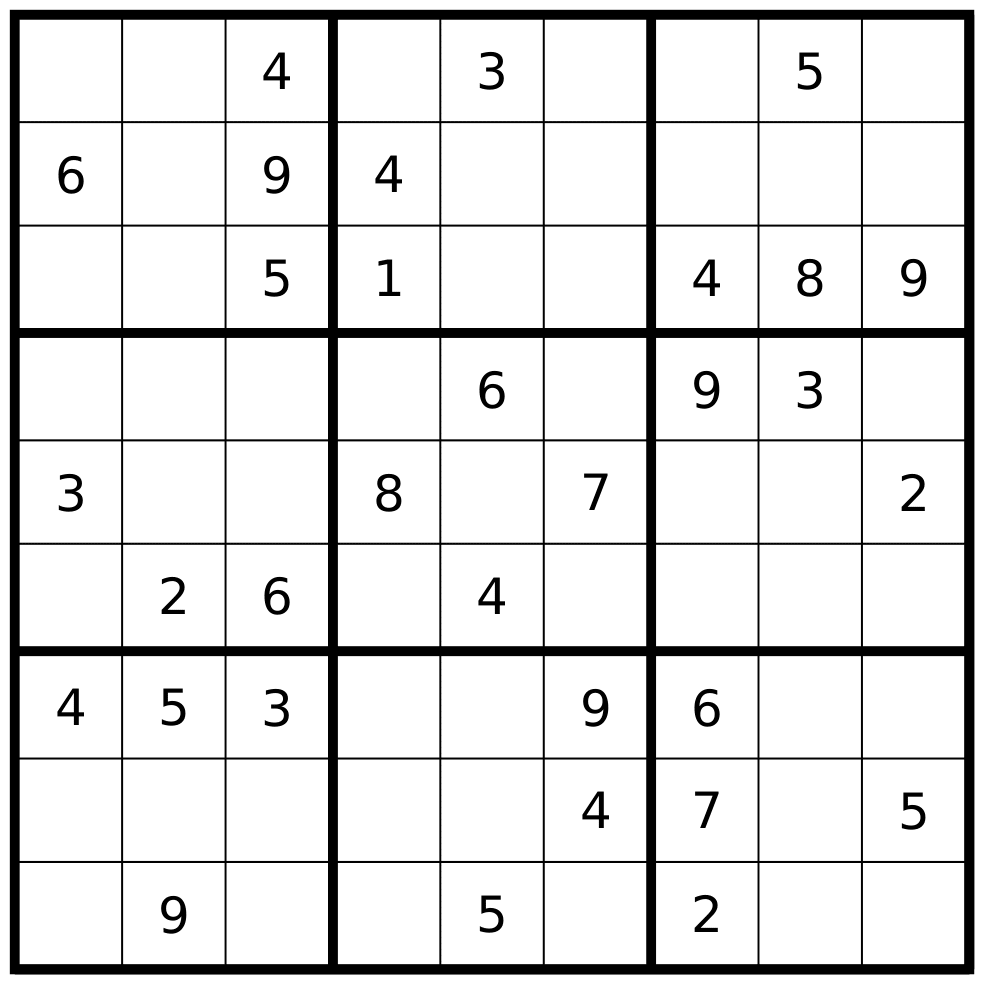
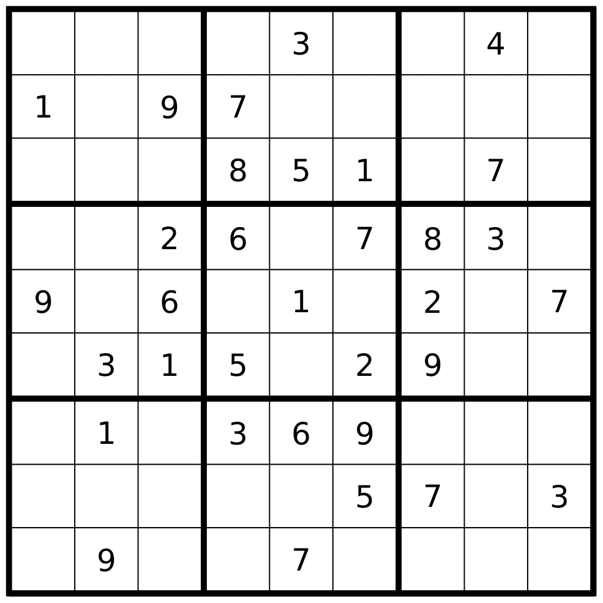
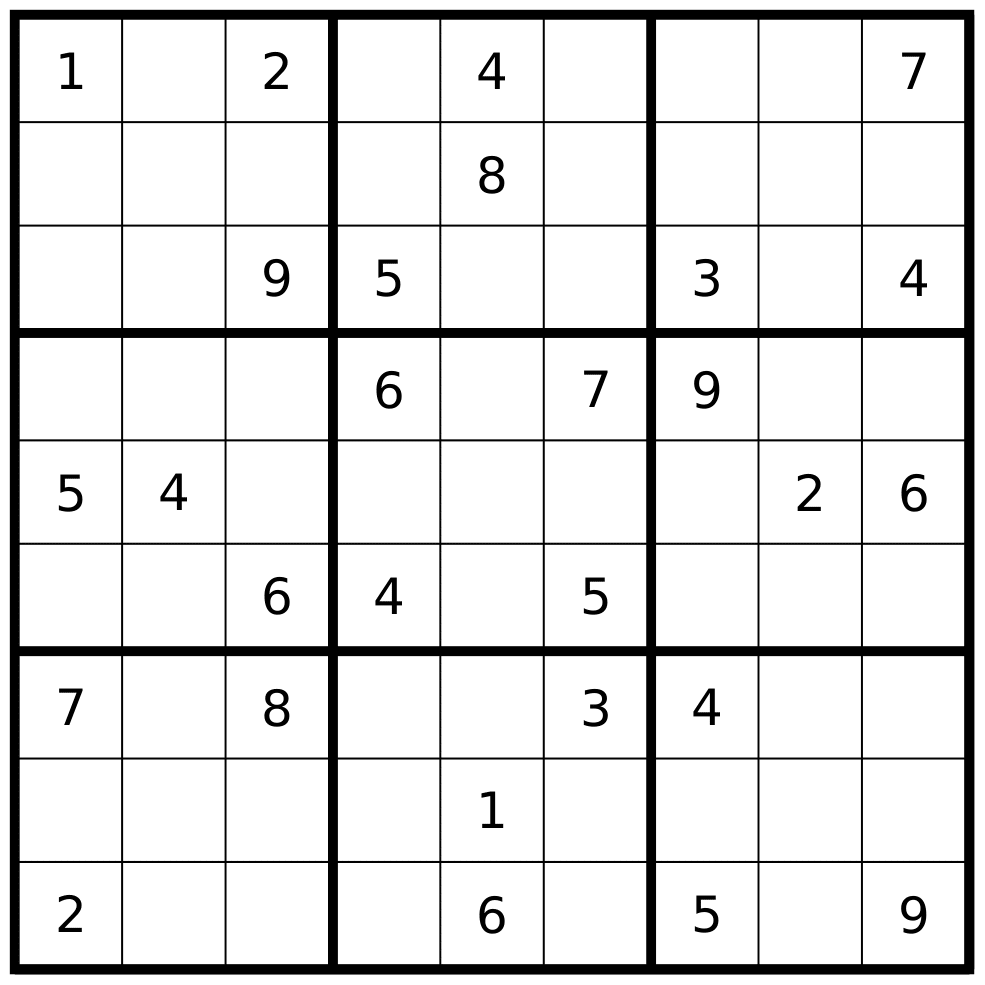
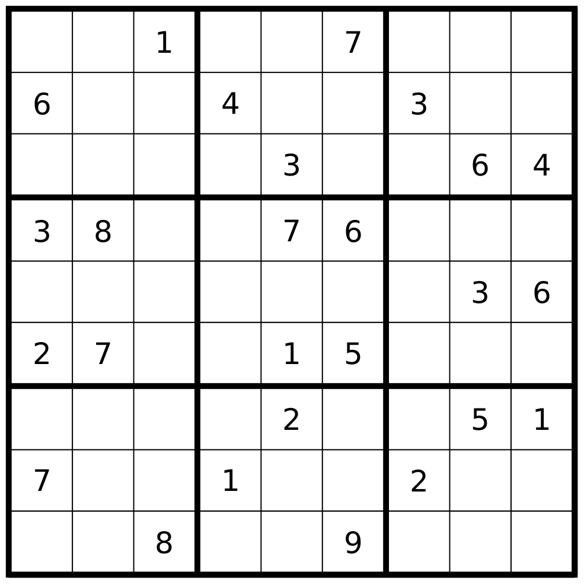

# Solving Constraint Satisfaction Problems

## Easy

<p align="center">
  
</p>

```.
Solved: "easy.txt"
+-------+-------+-------+
| 7 8 4 | 9 3 2 | 1 5 6 |
| 6 1 9 | 4 8 5 | 3 2 7 |
| 2 3 5 | 1 7 6 | 4 8 9 |
|-------+-------+-------|
| 5 7 8 | 2 6 1 | 9 3 4 |
| 3 4 1 | 8 9 7 | 5 6 2 |
| 9 2 6 | 5 4 3 | 8 7 1 |
|-------+-------+-------|
| 4 5 3 | 7 2 9 | 6 1 8 |
| 8 6 2 | 3 1 4 | 7 9 5 |
| 1 9 7 | 6 5 8 | 2 4 3 |
+-------+-------+-------+
number of "backtrack()" calls: 1
number of "backtrack()" fails: 0
```

We see that the backtrack function is only called 1 time! What this means is that we actually have enough information from the beginning to solve the entire board, by just applying the restrictions given.

## Medium

<p align="center">
  
</p>

```.
Solved: "medium.txt"
+-------+-------+-------+
| 8 7 5 | 9 3 6 | 1 4 2 |
| 1 6 9 | 7 2 4 | 3 8 5 |
| 2 4 3 | 8 5 1 | 6 7 9 |
|-------+-------+-------|
| 4 5 2 | 6 9 7 | 8 3 1 |
| 9 8 6 | 4 1 3 | 2 5 7 |
| 7 3 1 | 5 8 2 | 9 6 4 |
|-------+-------+-------|
| 5 1 7 | 3 6 9 | 4 2 8 |
| 6 2 8 | 1 4 5 | 7 9 3 |
| 3 9 4 | 2 7 8 | 5 1 6 |
+-------+-------+-------+
number of "backtrack()" calls: 3
number of "backtrack()" fails: 0
```

Here the backtrack function is called several times, but it never fails. This means that there are points where our algorithm has multiple choices, but all of the choices lead to valid solutions.

## Hard

<p align="center">
  
</p>

```.
Solved: "hard.txt"
+-------+-------+-------+
| 1 5 2 | 3 4 6 | 8 9 7 |
| 4 3 7 | 1 8 9 | 6 5 2 |
| 6 8 9 | 5 7 2 | 3 1 4 |
|-------+-------+-------|
| 8 2 1 | 6 3 7 | 9 4 5 |
| 5 4 3 | 8 9 1 | 7 2 6 |
| 9 7 6 | 4 2 5 | 1 8 3 |
|-------+-------+-------|
| 7 9 8 | 2 5 3 | 4 6 1 |
| 3 6 5 | 9 1 4 | 2 7 8 |
| 2 1 4 | 7 6 8 | 5 3 9 |
+-------+-------+-------+
number of "backtrack()" calls: 12
number of "backtrack()" fails: 4
```

The boards are getting to the point where the backtrack function fails. In other words, the algorithm has to "guess" some values which later makes a variable have no legal values, and we havve to "backtrack" that value.

## Very Hard

<p align="center">
  
</p>

```.
Solved: "veryhard.txt"
+-------+-------+-------+
| 4 3 1 | 8 6 7 | 9 2 5 |
| 6 5 2 | 4 9 1 | 3 8 7 |
| 8 9 7 | 5 3 2 | 1 6 4 |
|-------+-------+-------|
| 3 8 4 | 9 7 6 | 5 1 2 |
| 5 1 9 | 2 8 4 | 7 3 6 |
| 2 7 6 | 3 1 5 | 8 4 9 |
|-------+-------+-------|
| 9 4 3 | 7 2 8 | 6 5 1 |
| 7 6 5 | 1 4 3 | 2 9 8 |
| 1 2 8 | 6 5 9 | 4 7 3 |
+-------+-------+-------+
number of "backtrack()" calls: 68
number of "backtrack()" fails: 57
```

This final board is basically the same as the *hard* board, we see that there are many variables that initially could be a number of different values, but in reality only a few of these values actually provide a solution.
